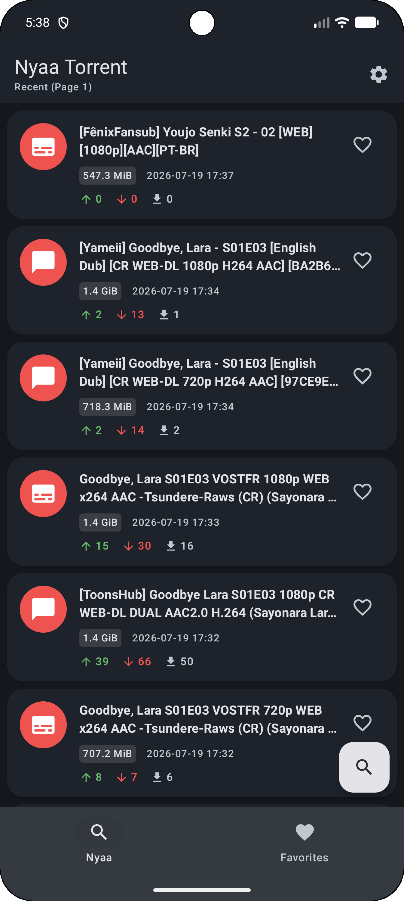
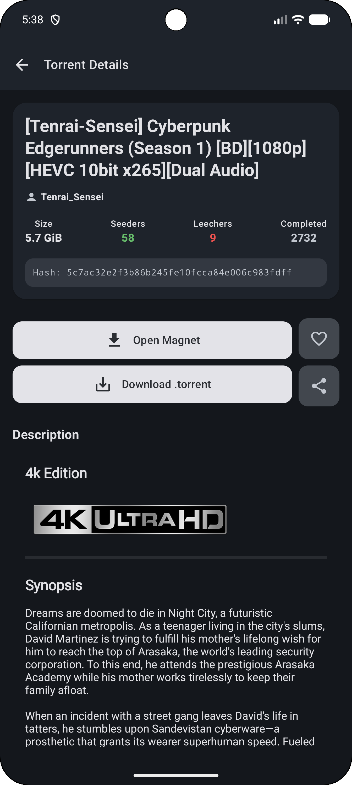
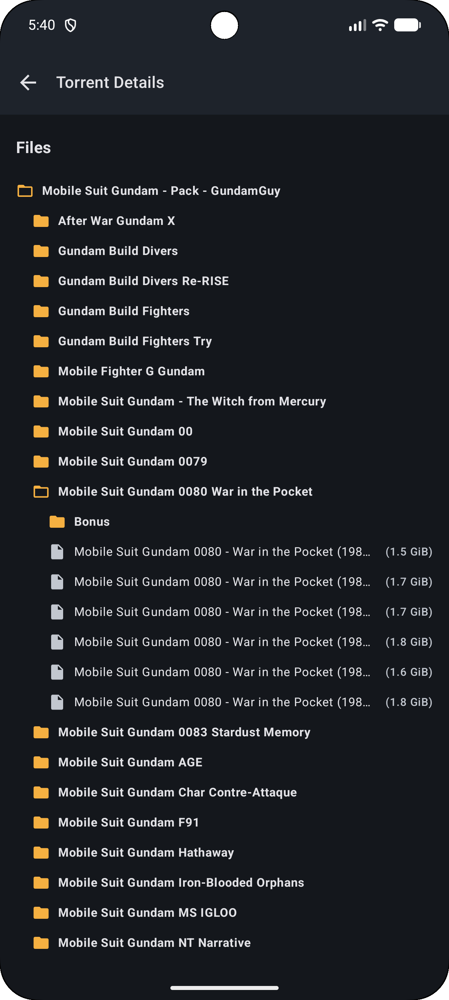

# NyaaAndroid

A native Android client for [Nyaa.si](https://nyaa.si) and its Sukebei sibling, built with
Kotlin and Jetpack Compose. It provides a fast, readable mobile experience for browsing,
searching, and retrieving torrents, backed by an MVVM architecture and an HTML-scraping
data layer (Nyaa exposes no public API).

## Screenshots

<table>
  <tr>
    <td align="center"></td>
    <td align="center"></td>
    <td align="center"></td>
  </tr>
  <tr>
    <td align="center"><b>Browse &amp; search</b></td>
    <td align="center"><b>Torrent detail</b></td>
    <td align="center"><b>File tree</b></td>
  </tr>
</table>

## Features

### Discovery and search
- Category browsing across all Nyaa categories (Anime, Audio, Literature, Live Action,
  Pictures, Software) with full sub-category support.
- Optional Sukebei (18+) index, opt-in from Settings, with its own category taxonomy and a
  dedicated switch in the bottom navigation bar.
- Keyword search and dedicated uploader search (`user:username`).
- Native quality filter (`No remakes` / `Trusted only`), exposed in the advanced search
  sheet.
- Sorting by date, size, seeders, leechers, or completed downloads, in either order.
- Saved searches pinned as quick-access chips.
- Paginated results with pull-to-refresh.

### Torrent interaction
- One-tap magnet handoff to any installed torrent client (Flud, LibreTorrent, etc.).
- Save the `.torrent` file wherever you want through the Android document picker — local
  storage or any connected cloud/remote provider — with no storage permission required.
- Trusted / remake indicators that mirror Nyaa's row colour coding (green for trusted
  uploads, red for remakes).
- Local favorites, persisted with Room for offline access.
- Native share sheet integration.
- Full tree view of a torrent's file contents before downloading.

### Content rendering
- Adaptive Markdown rendering: data tables stay horizontal, while screenshot-heavy
  tables are reflowed into vertical lists for readability on mobile.
- Full-screen image viewer with pinch, double-tap, and pan zoom (powered by Telephoto).
- Content sanitisation that handles Nyaa's Markdown quirks, BBCode remnants, and
  malformed table structures.

### Interface
- Material 3 (Material You) design.
- Four themes: Light, Dark, AMOLED, and System-default, plus an in-app language selector
  (English / French), all chosen from compact dropdown selectors.
- Bottom navigation bar to switch between Nyaa, Sukebei, and Favorites at a glance.
- Category badges and colour-coded seeder / leecher health indicators.
- Upload dates rendered in the device's local timezone.

## Tech stack

| Concern | Choice |
|---|---|
| Language | [Kotlin](https://kotlinlang.org/) 2.2 |
| UI | [Jetpack Compose](https://developer.android.com/jetpack/compose) with Material 3 |
| Architecture | MVVM (Model-View-ViewModel) |
| Networking | [Retrofit](https://square.github.io/retrofit/) and OkHttp |
| HTML parsing | [Jsoup](https://jsoup.org/) |
| Markdown | [Markwon](https://github.com/noties/Markwon) |
| Image loading | [Coil](https://coil-kt.github.io/coil/) |
| Image zoom | [Telephoto](https://github.com/saket/telephoto) |
| Local storage | [Room](https://developer.android.com/training/data-storage/room) |
| Preferences | Jetpack DataStore |
| Build | Android Gradle Plugin 9, Gradle 9.6 |

## Architecture

NyaaAndroid follows a light MVVM layering. Because Nyaa exposes no JSON API, the network
layer fetches raw HTML and parses it into domain models with Jsoup; every layer above the
`network` package works exclusively with clean Kotlin data classes.

```
UI (Compose)  ->  ViewModel  ->  Repository  ->  ApiService (Retrofit)
     ^               |               |                    |
     +---- UiState --+          Jsoup parsing <------ raw HTML
       (Loading /                     |
        Success /              domain models
        Error)            (TorrentUI, TorrentDetail)
```

See [`docs/ARCHITECTURE.md`](docs/ARCHITECTURE.md) for a full breakdown of each layer, the
Nyaa query parameters, and the HTML-scraping strategy.

## Requirements

- JDK 17 or newer (JDK 26 is supported by the bundled Gradle 9.6).
- Android SDK with Build Tools 36 (Android 16 / API 36).
- A recent Android Studio (Narwhal or newer) is recommended.

## Build and run

```bash
# Clone
git clone https://github.com/Nagutos/NyaaAndroid.git
cd NyaaAndroid

# Build a debug APK
./gradlew assembleDebug

# Or install directly onto a connected device
./gradlew installDebug
```

The APK is written to `app/build/outputs/apk/debug/`.

> If Gradle picks up an unsupported JDK, point it at a compatible one explicitly, for
> example `export JAVA_HOME=/usr/lib/jvm/java-17-openjdk`.

## Project structure

```
app/src/main/java/com/nagutos/nyaaandroid/
├── model/            Domain data classes (TorrentUI, TorrentDetail, Comment, NyaaSite)
├── network/          Retrofit service and Jsoup HTML parser
├── data/
│   ├── repository/   TorrentRepository, FavoriteRepository
│   └── local/entity/ Room database, DAOs, entities, migrations
├── ui/
│   ├── screens/      home / detail / favorites / settings
│   ├── components/   Reusable Compose widgets
│   ├── helpers/      Category colours and icons, scrollbar
│   └── theme/        Material 3 theme, colours, typography
└── utils/            ThemePreferences (theme, language, site), LocaleManager
```

## License

Provided for educational purposes. Nyaa.si content and trademarks belong to their
respective owners.
